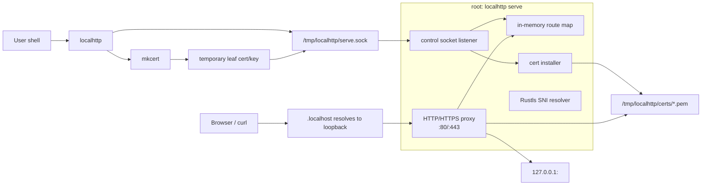
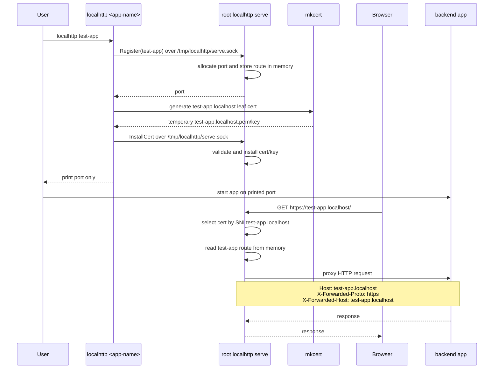
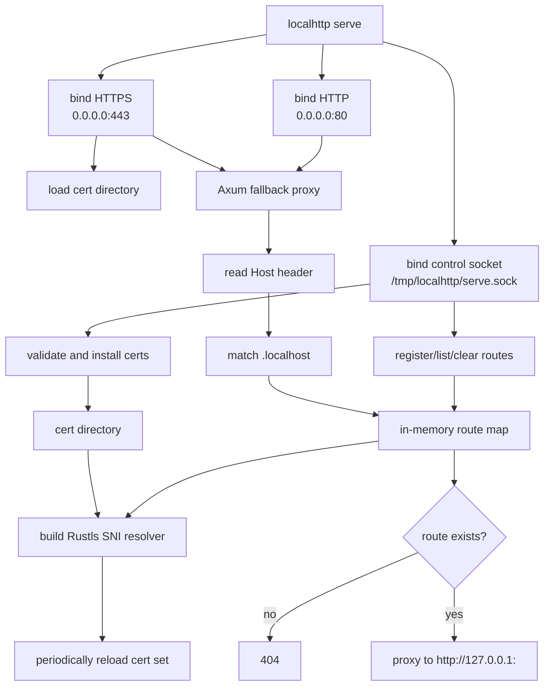
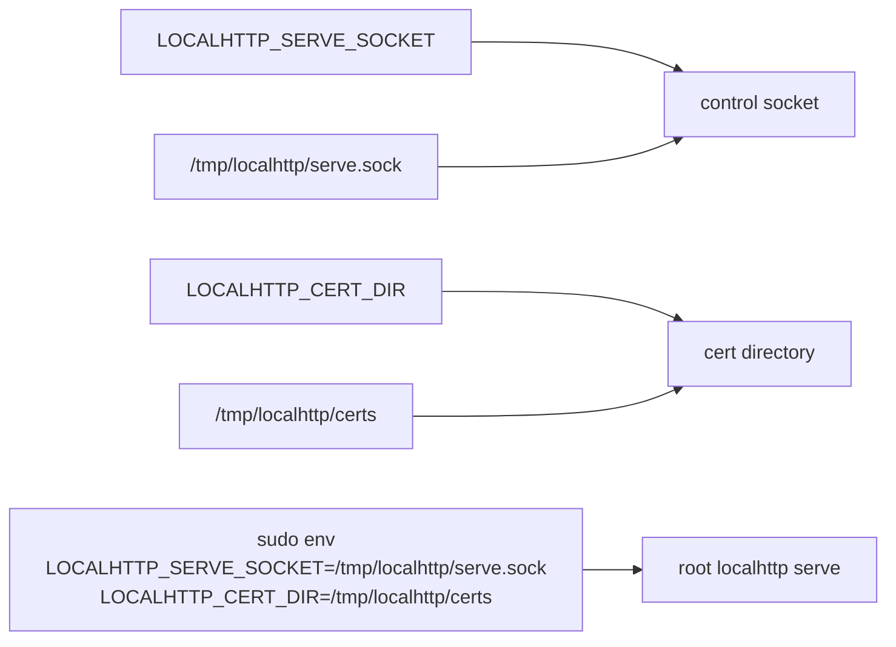

# localhttp Architecture

`localhttp` has two execution contexts:

- user shell commands generate certificates and send control requests
- root `serve` owns runtime state, binds privileged ports, and proxies browser traffic



## Runtime Flow



## State Model

Routes are process-local state owned by `localhttp serve`.

```text
CLI commands       -> /tmp/localhttp/serve.sock -> in-memory route map
Browser requests   -> :80/:443                  -> in-memory route map
```

There is no shared route file. Restarting `localhttp serve` clears registered
routes, so apps should re-register after the daemon restarts.

Certificates remain files because Rustls loads them from disk and `mkcert`
produces PEM files. The server owns final writes into:

```text
/tmp/localhttp/certs/
```

## Serve Process



## Serve Module Layers

```text
src/serve.rs
  process orchestration: bind HTTP/HTTPS, create shared state, start control socket

src/serve/control.rs
  control plane: register/list/clear routes, install certs, report cert info

src/serve/proxy.rs
  data plane: host matching, in-memory route lookup, URI/header rewrite

src/serve/tls.rs
  TLS runtime: static cert loading, SNI resolver construction, periodic reloads

src/serve/certs.rs
  certificate primitives: cert directory permissions, PEM parsing, host validation
```

## Paths And Environment


